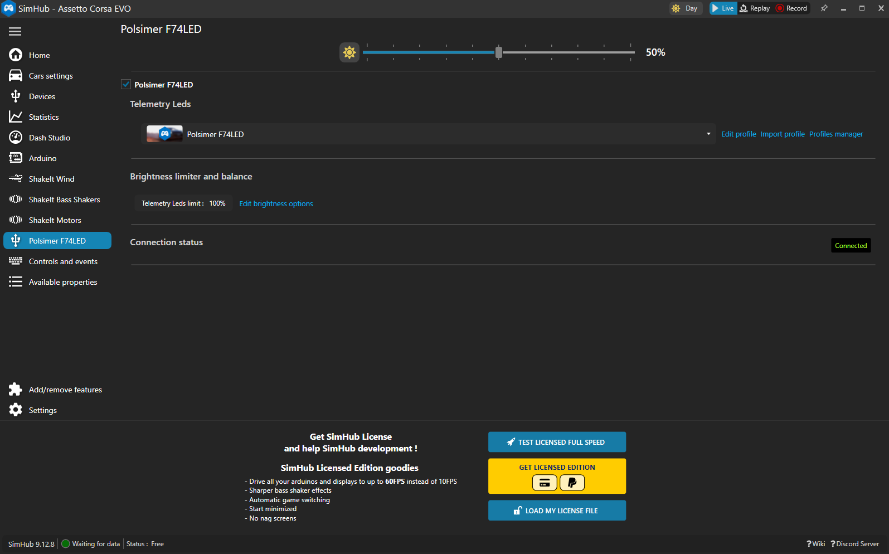

# Polsimer F74LED – SimHub Plugin

  
  
  

## Overview

A native C# plugin that connects the **Polsimer F74LED** steering wheel to SimHub's LED Effects Engine. It sends SimHub's LED output directly to the wheel over USB HID, without external middleware or background utilities.

## Features

* 🔌 **Native HID driver** — Operates directly inside SimHub process memory with 60 Hz hardware connection polling.
* ☀️ **Hardware brightness** — Native integration with SimHub's global brightness slider and Day/Night mode presets.
* 💾 **Persistent settings** — Retains brightness levels and hardware states across restarts.
* ⚡ **Frame state sync** — Automatically resets timeline offsets on USB re-plug and game state changes to prevent frame desynchronization.
* 🎮 **SimHub LED effects** — Displays effects configured in SimHub on the wheel's 12 LEDs, including game telemetry and track status.

## Installation

### ⚡ Auto (Recommended)

1. Download and extract the latest `Polsimer-F74LED-SimHub-vX.X.X.zip` from [Releases](../../releases)
2. Close SimHub
3. Run `setup.exe` and click **Install / update**
4. Open **SimHub**, click **Add/remove features** at the bottom of the left sidebar, and check **Polsimer F74LED**
5. Select the new **Polsimer F74LED** tab in the left navigation menu
6. Use SimHub's LED Effects settings to configure the effects you want displayed on the wheel

### 🛠️ Manual

1. Copy `Polsimer.SimHub.Plugin.dll` into your SimHub installation folder (e.g., `C:\Program Files (x86)\SimHub\` or `D:\SimHub\`)
2. Start SimHub, go to **Add/remove features** (or **Settings → Plugins**), and enable **Polsimer F74LED**
3. Use SimHub's LED Effects settings to configure the effects you want displayed on the wheel

## Uninstallation

To remove the plugin:
* Run `setup.exe` and click **Uninstall**. This removes the plugin and its saved settings.

## Troubleshooting

* **Tab missing in SimHub:** Click **Add/remove features** at the very bottom of the left sidebar in SimHub and ensure **Polsimer F74LED** is enabled.
* **LEDs not updating:** Verify the USB connection and check the **Connection status** in the Polsimer F74LED tab.
* **Config persistence:** Close SimHub normally using the window close button or system tray icon rather than terminating the task.
